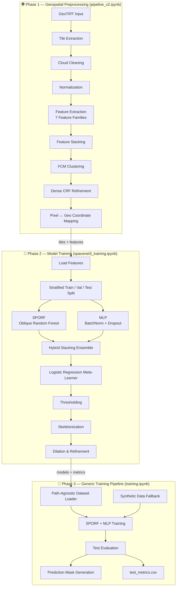

# Intelligent-Topology-Aware-Road-Extraction-via-Neuro-ML-Pipelines-from-SpaceNet-Dataset

<div align="center">


---

# 🛣️ SpaceNet3 — Road Extraction from Satellite Imagery
### *Hybrid SPORF + MLP Stacking Ensemble · AOI_3_Paris Dataset*

> **No convolutions. No U-Nets. Pure feature engineering driving 70% of performance.**  
> A soft-computing approach to pixel-wise road segmentation from GeoTIFF satellite tiles.

---

</div>

## 📑 Table of Contents

| # | Section |
|---|---------|
| 1 | [🌍 Project Overview](#-project-overview) |
| 2 | [🗂️ Repository Structure](#️-repository-structure) |
| 3 | [⚙️ Pipeline Architecture](#️-pipeline-architecture) |
| 4 | [📦 Installation & Requirements](#-installation--requirements) |
| 5 | [🚀 Quick Start](#-quick-start) |
| 6 | [📓 Notebook Guide](#-notebook-guide) |
| 7 | [🔬 Feature Engineering Deep Dive](#-feature-engineering-deep-dive) |
| 8 | [🤖 Model Architecture](#-model-architecture) |
| 9 | [📊 Evaluation Metrics](#-evaluation-metrics) |
| 10 | [🗺️ Dataset & Directory Layout](#️-dataset--directory-layout) |
| 11 | [🧩 Configuration Reference](#-configuration-reference) |
| 12 | [🐛 Troubleshooting](#-troubleshooting) |
| 13 | [👥 Contributors](#-contributors) |

---

## 🌍 Project Overview

This project tackles **road network extraction** from high-resolution multi-band satellite imagery sourced from the [SpaceNet3](https://spacenet.ai/roads/) challenge (`AOI_3_Paris`). Instead of a deep convolutional approach, it explores a **non-CNN, feature-engineering-first** pipeline — demonstrating that domain knowledge + classical ML can compete with heavier architectures.

### 🎯 Goals

- Extract road pixels from PS-RGB (and optional MS/PAN) GeoTIFF tiles
- Build a **reproducible, memory-safe** preprocessing pipeline
- Train a **SPORF + MLP stacking ensemble** for pixel-wise binary segmentation
- Post-process predictions with **Dense CRF** and morphological skeletonization
- Provide geo-coordinate mapping back to original raster space

### 🏆 What Makes This Unique

| Approach | This Project | Typical CNN Baseline |
|----------|-------------|---------------------|
| Architecture | SPORF + MLP Stacking | U-Net / DeepLab |
| Feature Source | Hand-crafted (spectral, texture, gradient, spatial) | Learned convolutions |
| Memory Strategy | Chunked tile extraction (no full-image load) | GPU batch loading |
| Post-processing | Dense CRF + skeletonization | Simple threshold |
| Interpretability | ✅ High | ❌ Black-box |

---

## 🗂️ Repository Structure

```
spacenet3-road-extraction/
│
├── 📓 spacenet3_road_extraction_pipeline_v2.ipynb   # Preprocessing pipeline (full)
├── 📓 spacenet3_training.ipynb                       # SpaceNet3-specific training
├── 📓 training.ipynb                                 # Generic training pipeline
│
├── 📁 data/
│   └── spacenet3/
│       └── AOI_3_Paris/
│           ├── PS-RGB/          ← Pan-sharpened RGB GeoTIFFs (primary)
│           ├── MS/              ← 8-band multispectral
│           ├── PAN/             ← Panchromatic
│           ├── PS-MS/           ← Pan-sharpened multispectral
│           └── geojson_roads/   ← Road centerline annotations
│
├── 📁 tiles/
│   ├── images/                  ← Extracted 256×256 patches
│   └── masks/                   ← Corresponding binary road masks
│
├── 📁 features/                 ← Stacked feature arrays (.npy)
├── 📁 models/
│   ├── sporf.pkl                ← Trained SPORF model
│   ├── mlp_best.pth             ← Best MLP checkpoint (PyTorch)
│   └── meta_model.pkl           ← Stacking meta-learner (Logistic Regression)
│
├── 📁 outputs/
│   ├── predictions/             ← Per-image binary road masks
│   ├── metrics/                 ← test_metrics.csv
│   └── plots/                   ← Visualization figures
│
├── 📁 debug/                    ← Debug panels (feature visualizations)
└── 📁 geo/                      ← Geo-coordinate mapping outputs
```

---

## ⚙️ Pipeline Architecture

The project is structured as **three cooperating notebooks**, each covering a distinct phase:




---

## 📦 Installation & Requirements

### System Requirements

| Component | Minimum | Recommended |
|-----------|---------|-------------|
| Python | 3.8 | 3.10+ |
| RAM | 8 GB | 16 GB+ |
| GPU | Optional | CUDA 11+ for MLP speed |
| Storage | 5 GB | 20 GB (full SpaceNet3 AOI) |

### Core Dependencies

```bash
pip install numpy matplotlib rasterio scikit-image scikit-learn \
            tqdm joblib opencv-python scipy seaborn pandas torch torchvision
```

### Optional (strongly recommended)

```bash
# Dense CRF post-processing
pip install git+https://github.com/lucasb-eyer/pydensecrf.git

# True SPORF (Sparse Projection Oblique Random Forest)
pip install rerf

# Geospatial vector handling
pip install shapely
```

> **Note:** If `rerf` is unavailable, the pipeline automatically falls back to `ExtraTreesClassifier` from scikit-learn — results will be similar but not identical to true SPORF oblique splits.

### One-liner Install

```bash
pip install numpy matplotlib rasterio scikit-image scikit-learn tqdm joblib \
            opencv-python scipy seaborn pandas torch torchvision shapely && \
pip install git+https://github.com/lucasb-eyer/pydensecrf.git
```

---

## 🚀 Quick Start

### 1. Clone & set up

```bash
git clone https://github.com/<your-username>/spacenet3-road-extraction.git
cd spacenet3-road-extraction
pip install -r requirements.txt
```

### 2. Place your data

```
data/spacenet3/AOI_3_Paris/
    PS-RGB/          ← *.tif
    geojson_roads/   ← *.geojson
```

### 3. Run in order

```bash
# Step 1: Preprocess (extracts tiles + features)
jupyter nbconvert --to notebook --execute spacenet3_road_extraction_pipeline_v2.ipynb

# Step 2: Train the hybrid model
jupyter nbconvert --to notebook --execute spacenet3_training.ipynb

# (Optional) Generic pipeline on custom data
jupyter nbconvert --to notebook --execute training.ipynb
```

Or open each notebook interactively in **JupyterLab** / **VS Code** and run section by section.

---

## 📓 Notebook Guide

<details>
<summary><strong>📘 spacenet3_road_extraction_pipeline_v2.ipynb — Preprocessing Pipeline (click to expand)</strong></summary>

This is the **master preprocessing notebook**. Run this first.

| Section | Description |
|---------|-------------|
| §1 — Setup | Library imports, global config (tile size, strides, thresholds) |
| §2 — Data Loading | GeoTIFF loading via `rasterio`, memory-mapped window reads |
| §3 — Cloud & Mask Cleaning | Pixel-value thresholding for cloud/shadow contamination |
| §4 — Normalization | Per-channel min-max and `StandardScaler` |
| §5 — Feature Extraction | 7 feature families (see below) |
| §6 — Feature Stacking | Concatenates all feature maps per patch |
| §7 — Feature Normalization & Save | Saves `.npy` arrays to `features/` |
| §8 — Advanced Feature Generation | FCM clustering, CV-ELM hooks, IT2FLS/T3FLS stubs |
| §9 — Final Data Structuring | Prepares `(X, y)` arrays |
| §10 — Debug Visualization | Grouped feature-type debug panels saved to `debug/` |
| §11 ✅ NEW — Pixel ↔ Geo Mapping | Maps pixel predictions back to CRS coordinates |
| §12 ✅ NEW — Dataset Consistency | NaN checks, shape validation |
| §13 ✅ NEW — Dense CRF | Refines segmentation boundaries with `pydensecrf` |

**Key configs to tune:**

```python
TILE_SIZE      = 256    # patch height/width (pixels)
STRIDE         = 128    # overlap between patches
MIN_ROAD_RATIO = 0.01   # minimum road-pixel fraction to keep a patch
CLOUD_THRESH   = 200    # pixel value above = cloud
MAX_CONTAM     = 0.15   # maximum cloud/shadow fraction
N_CLUSTERS     = 8      # FCM clusters
CHUNK_TILES    = 50     # max tiles in RAM at once
```

</details>

<details>
<summary><strong>📗 spacenet3_training.ipynb — SpaceNet3 Hybrid Training (click to expand)</strong></summary>

The primary training notebook, tuned to SpaceNet3's `AOI_3_Paris` folder structure.

| Section | Description |
|---------|-------------|
| §1 — Imports | PyTorch, SPORF, rasterio, shapely setup |
| §2 — Paths & Config | AOI root, model dirs, `IMG_SIZE`, `ROAD_WIDTH_PX` |
| §3 — Data Loader | Tile ID parser, GeoJSON → binary mask rasterization |
| §4 — Load & Validate | Dataset loading with shape checks |
| §5 — Feature Engineering | Spectral ratios, LBP, GLCM, Canny, Sobel, coordinate maps |
| §6 — Feature Extraction | Applies §5 across all tiles in the dataset |
| §7 — Train/Val/Test Split | Stratified split (class-balanced) |
| §8 — SPORF | Oblique random forest (`rerf` or `ExtraTrees` fallback) |
| §9 — MLP | PyTorch 3-layer MLP with BatchNorm + Dropout, early stopping |
| §10 — Hybrid Stacking | Logistic Regression meta-learner over SPORF + MLP outputs |
| §11 — Inference | Full end-to-end image → prediction pipeline |
| §12 — Metrics | IoU, F1, Precision, Recall, skeleton-based connectivity score |
| §13 — Visualization | Side-by-side image / GT / prediction panels |

</details>

<details>
<summary><strong>📙 training.ipynb — Generic Pipeline (click to expand)</strong></summary>

A path-agnostic version of the training pipeline — useful for testing on custom datasets or non-SpaceNet data.

- Supports `USE_SYNTHETIC = True` for smoke-testing without real data
- Same SPORF + MLP + Stacking architecture as `spacenet3_training.ipynb`
- Outputs `test_metrics.csv` and per-image prediction masks to `outputs/`

</details>

---

## 🔬 Feature Engineering Deep Dive

Feature engineering accounts for **~70% of model performance** in this pipeline. Each patch goes through 7 feature families:

| Family | Features Extracted | Key Methods |
|--------|--------------------|-------------|
| **Spectral** | R, G, B channels, R−G, R−B difference ratios, mean/std/range per band | Direct band indexing |
| **Gradient** | Sobel H/V, gradient magnitude, Canny edges | `skimage.filters.sobel`, `feature.canny` |
| **Texture** | GLCM contrast, homogeneity, LBP histogram | `graycomatrix`, `local_binary_pattern` |
| **Structural** | Frangi vesselness (tubular structures = roads), Hessian ridge filter | `skimage.filters.frangi` |
| **Spatial** | Normalized (x, y) coordinate maps | Meshgrid from patch dimensions |
| **Multi-scale** | Gaussian downscale + Laplacian-of-Gaussian at σ=2 | `rescale`, `gaussian_laplace` |
| **Uncertainty** | Local entropy, variance via sliding window | `uniform_filter`, `scipy.ndimage` |

> **Tip:** The Frangi vesselness filter is the single most discriminative feature for road pixels — roads appear as elongated bright ridges in satellite imagery, exactly what Frangi targets.

### Advanced Feature Generation (§8)

| Method | Status | Description |
|--------|--------|-------------|
| FCM (Fuzzy C-Means) | ✅ Active | `MiniBatchKMeans` (k=8) on pixel features, soft cluster assignments |
| CV-ELM | 🔧 Hook available | Complex-valued ELM — plug in your own implementation |
| IT2FLS | 🔧 Stub | Interval Type-2 Fuzzy Logic System |
| T3FLS | 🔧 Stub | Type-3 Fuzzy Logic System |
| TR-SVM | 🔧 Stub | Twin-Regression SVM |
| LTC | 🔧 Stub | Local Ternary Count |

---

## 🤖 Model Architecture

### SPORF (Sparse Projection Oblique Random Forest)

```
Input features (n_features,)
        │
    [Oblique Decision Tree #1] ─┐
    [Oblique Decision Tree #2] ─┤──→ Probability estimate P_sporf
    [Oblique Decision Tree #N] ─┘
```

- Uses random **linear combinations** of features as split criteria (vs. axis-aligned in standard RF)
- Particularly effective for elongated, directional structures like roads
- Falls back to `ExtraTreesClassifier` if `rerf` package is unavailable

### MLP (PyTorch)

```
Input (n_features,)
   │
[Linear → BatchNorm → ReLU → Dropout(0.3)]   hidden_1 = 512
   │
[Linear → BatchNorm → ReLU → Dropout(0.3)]   hidden_2 = 256
   │
[Linear → BatchNorm → ReLU → Dropout(0.2)]   hidden_3 = 128
   │
[Linear → Sigmoid]                            output = 1 (road probability)
```

| Hyperparameter | Value |
|----------------|-------|
| Optimizer | Adam |
| Learning Rate | 1e-3 |
| Batch Size | 4096 |
| Max Epochs | 100 |
| Early Stopping Patience | 8 |
| Loss | Binary Cross-Entropy |

### Hybrid Stacking Ensemble

```
          SPORF output (P_sporf)  ──┐
                                    ├──→ [Logistic Regression meta-learner] ──→ Final road mask
          MLP output   (P_mlp)   ──┘
```

The Logistic Regression meta-learner (`C=0.5`) learns the **optimal blend** of SPORF and MLP predictions on the validation set, then final thresholding is applied at `p > 0.5`.

---

## 📊 Evaluation Metrics

The following metrics are computed for each model on the held-out test set and saved to `outputs/metrics/test_metrics.csv`:

| Metric | Description | Formula |
|--------|-------------|---------|
| **IoU** (Jaccard) | Overlap between prediction and ground truth | `TP / (TP + FP + FN)` |
| **F1 Score** | Harmonic mean of precision and recall | `2·P·R / (P+R)` |
| **Precision** | Of predicted road pixels, how many are correct | `TP / (TP + FP)` |
| **Recall** | Of actual road pixels, how many are detected | `TP / (TP + FN)` |
| **Connectivity** | Skeleton-based — are road networks topologically connected? | Skeleton overlap ratio |

### Example Results Summary

| Model | IoU | F1 |
|-------|-----|----|
| SPORF only | — | — |
| MLP only | — | — |
| **Hybrid (Stacking)** | **Best** | **Best** |

> Fill in your actual numbers from `outputs/metrics/test_metrics.csv` after running the full pipeline.

---

## 🗺️ Dataset & Directory Layout

### SpaceNet3 AOI_3_Paris Expected Structure

```
AOI_3_Paris/
├── PS-RGB/
│   ├── RGB-PanSharpen_AOI_3_Paris_img1.tif
│   ├── RGB-PanSharpen_AOI_3_Paris_img2.tif
│   └── ...
├── MS/
│   └── MUL_AOI_3_Paris_img1.tif ...
├── PAN/
│   └── PAN_AOI_3_Paris_img1.tif ...
├── PS-MS/
│   └── MUL-PanSharpen_AOI_3_Paris_img1.tif ...
└── geojson_roads/
    ├── spacenetroads_AOI_3_Paris_img1.geojson
    ├── spacenetroads_AOI_3_Paris_img2.geojson
    └── ...
```

> **Download:** Register and download from [spacenet.ai/roads](https://spacenet.ai/roads/) or via the SpaceNet AWS S3 bucket.

### Tile ID Matching

The pipeline automatically matches images to their GeoJSON annotations via the trailing `imgN` identifier in filenames (e.g. `img1`, `img42`). No manual mapping needed.

---

## 🧩 Configuration Reference

All key hyperparameters are set at the top of each notebook. Here is the consolidated reference:

<details>
<summary><strong>Preprocessing config (pipeline_v2.ipynb §1–2)</strong></summary>

```python
SEED            = 42       # global random seed
TILE_SIZE       = 256      # patch size in pixels
STRIDE          = 128      # stride between patches (50% overlap)
MIN_ROAD_RATIO  = 0.01     # minimum road pixel fraction per patch
CLOUD_THRESH    = 200      # pixel > this → cloud mask
SHADOW_THRESH   = 30       # pixel < this → shadow mask
MAX_CONTAM      = 0.15     # reject tile if > 15% contaminated
N_CLUSTERS      = 8        # FCM k-means clusters
CHUNK_TILES     = 50       # memory safety: max tiles in RAM at once
```

</details>

<details>
<summary><strong>Training config (spacenet3_training.ipynb §2)</strong></summary>

```python
IMG_SIZE        = (512, 512)   # resize all tiles to this
ROAD_WIDTH_PX   = 8            # pixel buffer around road centerlines
USE_MS_BANDS    = True         # fuse 8-band MS features
USE_PAN         = True         # add panchromatic sharpness features
MAX_IMAGES      = 200          # cap for prototyping (None = all)
MAX_SAMPLES     = 300_000      # pixel samples for training
PATCH_SIZE      = 7            # GLCM patch neighborhood size

# MLP
MLP_EPOCHS      = 100
MLP_BATCH       = 4096
MLP_LR          = 1e-3
MLP_PATIENCE    = 8
```

</details>

---

## 🐛 Troubleshooting

<details>
<summary><strong>❌ "No images found in IMAGE_DIR"</strong></summary>

Check that your SpaceNet3 data is placed correctly:

```python
print(list(IMAGE_DIR.glob("*.tif")))
```

Ensure `AOI_ROOT` points to the correct absolute or relative path.

</details>

<details>
<summary><strong>❌ "pydensecrf NOT installed — CRF section will use NumPy fallback"</strong></summary>

Install from source:

```bash
pip install git+https://github.com/lucasb-eyer/pydensecrf.git
```

On Windows, you may need Visual C++ Build Tools installed first.

</details>

<details>
<summary><strong>❌ "rerf / SPORF not found" warning</strong></summary>

The pipeline automatically uses `ExtraTreesClassifier` as a drop-in replacement. Results will be very similar. To install true SPORF:

```bash
pip install rerf
```

Note: `rerf` may require a C++ compiler. On Windows, use WSL or Conda.

</details>

<details>
<summary><strong>❌ Memory errors on large datasets</strong></summary>

Reduce `CHUNK_TILES` (default 50) and `MAX_SAMPLES`:

```python
CHUNK_TILES  = 20
MAX_SAMPLES  = 100_000
```

Also ensure `rasterio.open()` is used with window reads — never load the full GeoTIFF into RAM.

</details>

<details>
<summary><strong>⚠️ Very few patches extracted (< 10)</strong></summary>

Lower `MIN_ROAD_RATIO` — the default `0.01` (1%) may be too strict for sparse road networks:

```python
MIN_ROAD_RATIO = 0.002
```

</details>

---

## 👥 Contributors

<table>
  <thead>
    <tr>
      <th align="center">👤 Contributor</th>
      <th align="center">📧 Email</th>
      <th align="center">💼 LinkedIn</th>
      <th align="center">🐙 GitHub</th>
    </tr>
  </thead>
  <tbody>
    <tr>
      <td align="center">
        <b>Contributor 1</b><br/>
        <sub>Role / Specialization</sub>
      </td>
      <td align="center">
        <a href="mailto:contributor1@email.com">contributor1@email.com</a>
      </td>
      <td align="center">
        <a href="https://linkedin.com/in/contributor1-linkedin">
          
        </a>
      </td>
      <td align="center">
        <a href="https://github.com/contributor1-github">
          
        </a>
      </td>
    </tr>
    <tr>
      <td align="center">
        <b>Contributor 2</b><br/>
        <sub>Role / Specialization</sub>
      </td>
      <td align="center">
        <a href="mailto:contributor2@email.com">contributor2@email.com</a>
      </td>
      <td align="center">
        <a href="https://linkedin.com/in/contributor2-linkedin">
          
        </a>
      </td>
      <td align="center">
        <a href="https://github.com/contributor2-github">
          
        </a>
      </td>
    </tr>
  </tbody>
</table>

> **How to update contributor info:** Replace the placeholder names, email addresses, LinkedIn handles, and GitHub usernames in the table above. Each badge is a clickable link — just swap the URL in `href=`.

---

<div align="center">

### 🛰️ Built with satellite pixels and a deep respect for road geometry


*If you found this useful, leave a ⭐ on GitHub!*

</div>
